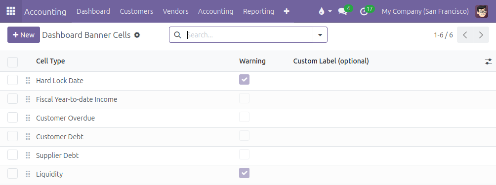

Go to the menu **Invoicing \> Configuration \> Dashboard \> Dashboard
Banner Cells**: in this menu, you can add or remove cells from the
banner, change the cell type, modify the order via drag-and-drop,
customize the labels if necessary.

Many cell types are available:

- **Income** with 4 options: *Fiscal Year-to-date Income*, *Year-to-date
  Income*, *Quarter-to-date Income* and *Month-to-date Income*. It
  displays the period balance of the accounts with type *Income* and
  *Other Income*.
- **Liquidity**: it display the ending balance of the accounts linked to
  a bank or cash or credit journal.
- **Customer Debt**: it displays the ending balance of the default
  *Account Receivable* and, if the point of sale is installed, the
  intermediary account used for unidentified customers.
- **Customer Overdue**: same as the *Customer Debt*, but limited to
  journal items with a due date in the past.
- **Supplier Debt**: it displays the ending balance of the default
  *Account Payable*.
- **Lock dates**: all the lock dates are available: *Tax Return Lock
  Date*, *Sales Lock Date*, *Purchase Lock Date*, *Global Lock Date* and
  *Hard Lock Date*.

The module is designed to allow the modification of the computation of
the different cell types by inheriting the method
*\_prepare_cell_data_<cell_type>()* or *\_prepare_cell_data()*.
It is also easy for a developper to add more cell types.

It is possible to display a cell as a warning cell (yellow background color instead of light grey): click on the *Warning* option and customize the conditions to trigger the warning.

